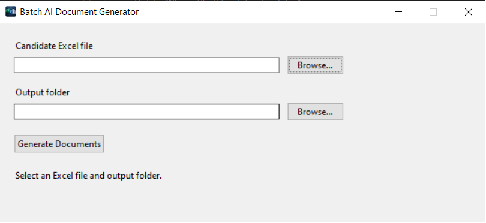

# Batch AI Document Generator

Batch AI Document Generator is a Windows desktop application for batch-generating personalized resumes and cover letters from structured Excel candidate data.

The application validates candidate records, uses a local Ollama model for controlled AI-generated content, renders DOCX files from templates, and produces a JSON report for every batch.

## Application



## Features

- Windows desktop GUI built with Tkinter
- Batch candidate import from `.xlsx`
- Local AI generation with Ollama
- `qwen2.5:3b` model
- No paid AI API required
- Candidate data processed locally
- Automatic Ollama and model preparation
- Pydantic-based input validation
- `client_id` used as the primary candidate identifier
- Duplicate `client_id` detection
- Invalid candidate records are skipped without stopping the batch
- Generation failure for one candidate does not stop remaining candidates
- Resume and cover letter generation from DOCX templates
- Separate output folder for each candidate
- `batch_report.json` with processing results
- Windows executable built with PyInstaller
- Automated tests with pytest

## Processing Flow

```text
Excel file
    |
    v
Validate required columns
    |
    v
Validate individual records
    |
    +---- invalid record --------> skipped
    |
    v
Valid candidate
    |
    v
Local Ollama model
    |
    v
Structured generated content
    |
    v
Deterministic post-processing
    |
    v
DOCX templates
    |
    v
resume.docx + cover_letter.docx
```

## Input Excel Format

The application accepts `.xlsx` files.

### Required columns

| Column | Description |
|---|---|
| `client_id` | Unique candidate identifier |
| `first_name` | Candidate first name |
| `last_name` | Candidate last name |
| `email` | Candidate email |
| `target_role` | Target position |
| `years_experience` | Years of professional experience |
| `skills` | Skills separated by commas or semicolons |
| `current_company` | Current employer |
| `current_role` | Current position |
| `location` | Candidate location |
| `key_achievement` | Key professional achievement |
| `tone` | `professional`, `technical`, or `concise` |

### Optional columns

| Column | Description |
|---|---|
| `target_company` | Target employer. Defaults to `Your organization` |

Example candidate:

```text
client_id: C001
first_name: Anna
last_name: Kowalska
email: anna@example.com
target_role: Automation Engineer
years_experience: 5
skills: Siemens TIA Portal; WinCC; OPC UA; Python
current_company: Example Automation
current_role: Automation Engineer
location: Kraków
key_achievement: Commissioned a new automated production line.
tone: technical
target_company: Example Industries
```

## Validation

### Structural Excel errors

If an entire required column is missing, the batch is stopped.

Example:

```text
Missing required columns: ['email']
```

The application cannot safely process the file when its required structure is incomplete.

### Invalid candidate records

Errors affecting only an individual candidate do not stop the batch.

Examples include:

- missing required value
- invalid email
- invalid `tone`
- invalid `years_experience`
- invalid `client_id`
- duplicate `client_id`

Such records are classified as:

```text
skipped
```

Processing continues with the next candidate.

### Duplicate IDs

`client_id` is the primary identifier.

The first occurrence of a valid ID is accepted. Later occurrences of the same ID are skipped.

Example:

```text
C001 -> processed
C002 -> processed
C001 -> skipped: duplicate client_id
```

### Generation failures

A candidate that passes validation can still fail later, for example because of an AI, document-rendering, or filesystem error.

Such records are classified as:

```text
failed
```

The rest of the batch continues processing.

In summary:

```text
succeeded = documents generated successfully
skipped   = invalid input record
failed    = valid input, but generation failed
```

## Output

Example:

```text
output/
├── C001_Anna_Kowalska/
│   ├── resume.docx
│   └── cover_letter.docx
├── C002_Jan_Nowak/
│   ├── resume.docx
│   └── cover_letter.docx
└── batch_report.json
```

## Batch Report

Each completed batch creates:

```text
batch_report.json
```

The report contains:

- total processed records
- successful candidates
- skipped records
- generation failures
- candidate IDs
- Excel row numbers for skipped records
- error descriptions

Example:

```json
{
  "processed": 4,
  "succeeded": 2,
  "failed": 1,
  "skipped": 1,
  "failures": [
    {
      "client_id": "C004",
      "error": "Document generation error"
    }
  ],
  "skipped_records": [
    {
      "row_number": 3,
      "client_id": "C002",
      "error": "field 'email': invalid value"
    }
  ]
}
```

## AI Generation

The application uses:

```text
Ollama
qwen2.5:3b
```

The LLM runs locally.

The application uses a hybrid generation approach.

The AI primarily generates the professional summary, while critical factual sections are generated or overwritten deterministically from the candidate input.

This includes:

- candidate skills
- application opening
- role-fit paragraph
- key achievement
- closing paragraph

This approach reduces hallucination risk and keeps important document content traceable to the Excel source data.

## First Run

On startup, the application checks whether the local AI environment is available.

If necessary, it attempts to:

1. locate Ollama,
2. install Ollama on Windows,
3. start the Ollama service,
4. check whether `qwen2.5:3b` is installed,
5. download the model if required.

The first run can therefore take longer than later runs.

Internet access is required only when Ollama or the model must be downloaded.

Document generation itself uses the local Ollama service.

## Using the Windows Application

Run:

```text
BatchAIDocumentGenerator.exe
```

Then:

1. Select the candidate `.xlsx` file.
2. Select the output folder.
3. Click **Generate Documents**.
4. Wait for processing to finish.
5. Review the generated candidate folders.
6. Review `batch_report.json` if records were skipped or failed.

The packaged application does not require the user to install Python or pip.

## Development Setup

Create a virtual environment:

```powershell
python -m venv .venv
```

Activate it:

```powershell
.\.venv\Scripts\Activate.ps1
```

Install dependencies:

```powershell
python -m pip install -r requirements.txt
```

Run the application:

```powershell
python -m app
```

## Tests

Run:

```powershell
python -m pytest -q
```

Current test suite:

```text
37 passed
```

The tests cover the main application layers, including:

- data models
- Excel loading and validation
- AI content generation
- document rendering
- document service
- batch pipeline

## Building the Windows Application

Install PyInstaller if necessary:

```powershell
python -m pip install pyinstaller
```

Run:

```powershell
.\build.ps1
```

The build is created in:

```text
dist\BatchAIDocumentGenerator\
```

The executable is:

```text
dist\BatchAIDocumentGenerator\BatchAIDocumentGenerator.exe
```

The application uses PyInstaller `onedir` mode.

The complete `BatchAIDocumentGenerator` directory must therefore be distributed, not only the `.exe`.

## Project Structure

```text
BatchAIDocumentGenerator/
├── app/
│   ├── __init__.py
│   ├── __main__.py
│   ├── bootstrap.py
│   ├── client_repository.py
│   ├── content_generator.py
│   ├── document_renderer.py
│   ├── document_service.py
│   ├── gui.py
│   ├── models.py
│   └── pipeline.py
├── assets/
│   ├── app.ico
│   └── app.png
├── docs/
│   └── gui.png
├── fixtures/
├── templates/
│   ├── resume_template.docx
│   └── cover_letter_template.docx
├── tests/
├── build.ps1
├── launcher.py
├── README.md
└── requirements.txt
```

## Architecture

### `client_repository.py`

Loads Excel data and validates candidate records.

Responsibilities include:

- required-column validation
- candidate validation
- duplicate-ID detection
- collecting skipped records

### `models.py`

Contains Pydantic models representing:

- candidate input
- generated AI content
- skipped records
- generation failures
- batch results

### `content_generator.py`

Contains the content-generation abstraction and Ollama implementation.

The generator produces structured output validated against the application model.

Critical factual sections are subsequently normalized deterministically.

### `document_renderer.py`

Loads the DOCX templates and replaces placeholders with candidate and generated content.

### `document_service.py`

Creates candidate output directories and renders:

```text
resume.docx
cover_letter.docx
```

### `pipeline.py`

Coordinates batch processing.

It separates:

```text
skipped
```

input records from:

```text
failed
```

generation attempts.

It also writes:

```text
batch_report.json
```

### `bootstrap.py`

Prepares the local Ollama environment and required model.

### `gui.py`

Provides the Windows desktop user interface and runs generation in a worker thread so that the GUI remains responsive.

## Technology Stack

- Python
- Tkinter
- pandas
- openpyxl
- Pydantic
- python-docx
- Ollama
- Qwen 2.5
- pytest
- PyInstaller

## Current Status

The application provides the complete end-to-end workflow:

```text
Excel
→ validation
→ local AI
→ deterministic content control
→ DOCX generation
→ batch report
→ Windows GUI
→ packaged executable
```